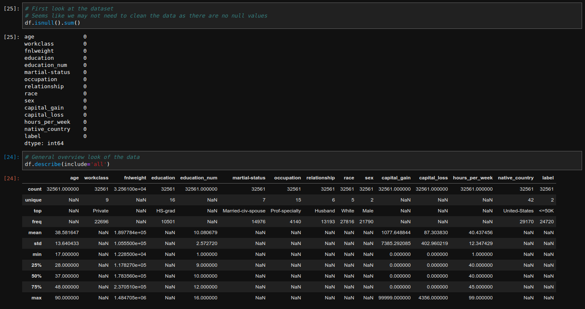
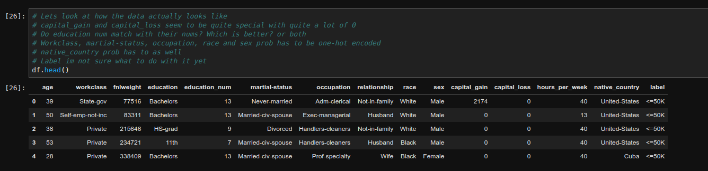
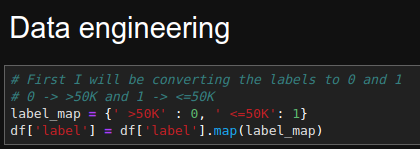
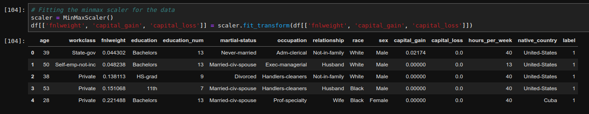
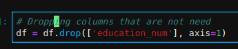
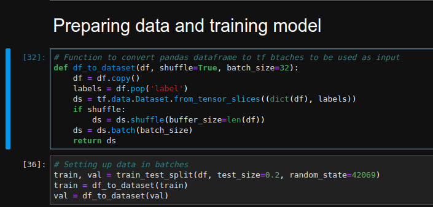
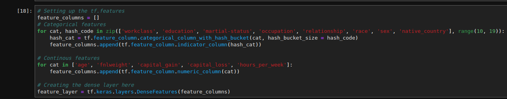
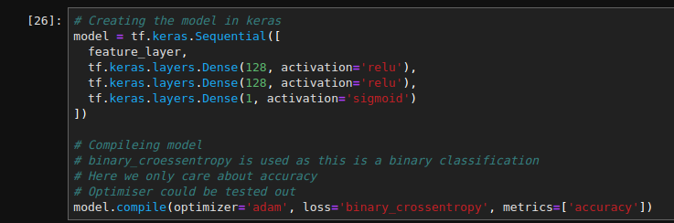
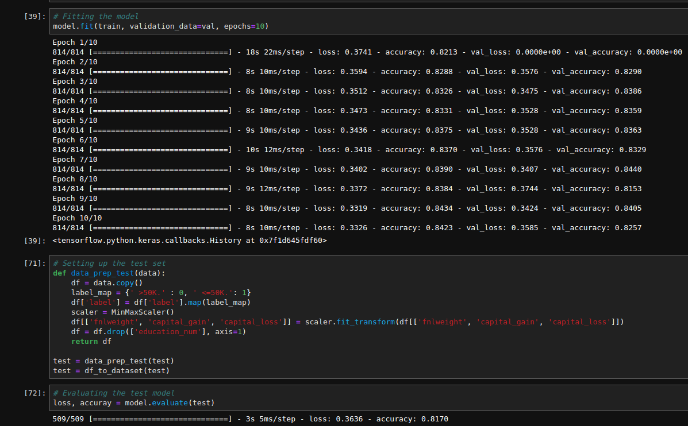

# Advanced Solve a machine learning problem using a UCI data_set

This is my submission for Google Code-in 2019 task.

Note: In this markdown, as much as I can, I will screenshot the cell I am talking about and place it here, however I have more comments in the cell itself. Thus I may omit some stuff already in the comments.

[Link](https://colab.research.google.com/drive/1AydiQCLSY4ZhZ6mKTzyylmo1GtTHZrgy) to the google colab notebook.

# Question I gave myself to solve  

Based on the data, classify if a person earned <=50K or >50K per year.

Thought process behind what I did:  

## First look at the data  
First thing I did after setting up the links to dl the files using urllib was to look at the data in pandas.

[Link](#data-dictonary) to appendix of the data dictionary  

Below you can see my looking at some basic stats of the data:  

  

Looking at some of the raw data:  

  

From this, we can see how some fields are a bit peticular. I'll break them down by columns below.  

- `education-num`
  - This field seems to be continous, however look at the field closer, we see that it is actually a categorical feature. This is as there are only specific values here which corrospond to the highest level of education a person got.
  - Dropping this column in favour of the categorical `education` column
- `fnlweight` 
  - The data points seem to be spread very far apart in terms of values.
  - Going to standardise all of them
- `capital_gain` and `capital_loss`
  - Seem to be very spread out and a lot of the samples have this as 0
  - Have to standardise the values

## Data engineering/cleaning

Here I mapped the label of `'<=50K'` and `'>50K'` to `0` and `1`.  

  

Then I scaled the columns `['fnlweight', 'capital_gain', 'capital_loss']` by minmax in scikit-learn.  

  

Lasty I dropped the column `education_num` so as to not confuse the estimator with a continous value.  

  

## Data and tf preparations  

In this part, I used one of tensorflows tutorial to turn pandas dataframes into batches to input into a tensorflow model.  

Then I used `train_test_split` from `sklearn.preprocessing` to split the train dataset into a train and validation.  

  

I then made the feature columns needed by `tf.keras.Sequential` to use.  

Creating the keras model  

## Training and evaluating the models

Here I train the model, then use the given test set to test the accuracy of the model.  

## Final thoughts  

Overall I think there is a lot I could improve on this project. One being engineering more features. Also I could have done more EDA to find out if some of the data were skewed and try to account for that.  

Although I do not know where to begin with issues such as those. Overall, this was quite a fun project to see if I could use tensorflow to create a model to classify the income bracket of a person.

## Apendix

### Data dictonary

age - continous  
workclass - categorical  
fnlweight - number of ppl the person believes are below 50K(?), continous  
education - category of final education  
education-num - number of years in education, continous  
martial-status - category  
occupation - pre-defined category  
relationship - relative to the person themselves  
race - categorical  
sex - categorical  
capital-gain - continous  
capital-loss - continous  
hours-per-week - number of hours worked per week  
native-country - categorical  

Final label - <=50K, >50K  

