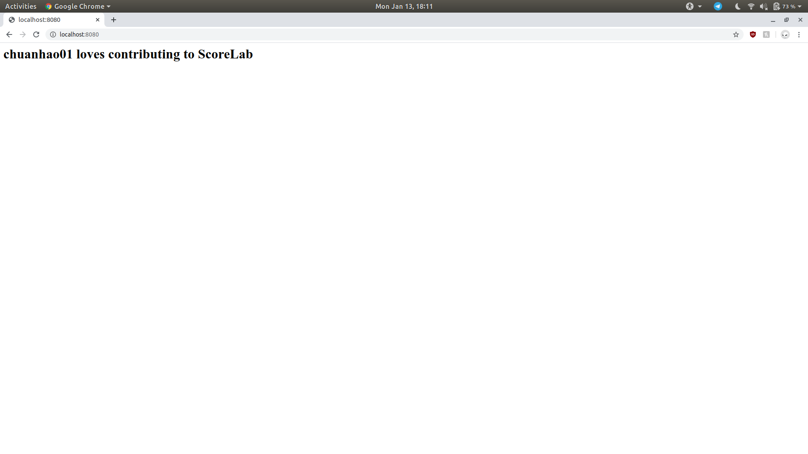

# [Python/Java/C++/Perl/PHP/Rust] Create and host a local server - SCoRe Lab  

Hi this is the readme for the task `[Python/Java/C++/Perl/PHP/Rust] Create and host a local server - SCoRe Lab`.

For the task, I used mainly Javascript to create and host the localserver.  
The technologies I used were:  
Node.js: [Link]('https://nodejs.org/en/')  
Express.js: [Link]('http://expressjs.com/')  

The explaintion of the code are comments in the code.  

### Screenshot of the html page  
